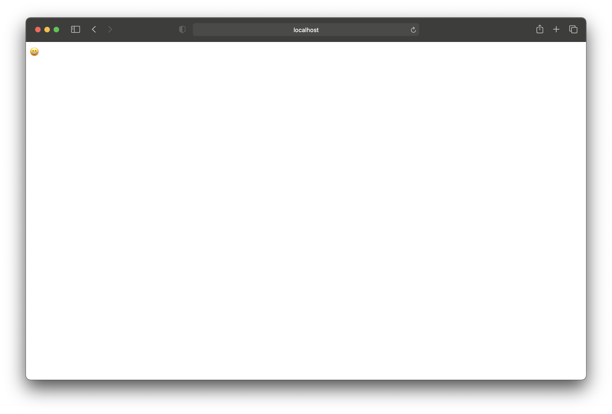

# Web Server Documentation 

## Bash Scripts

* .config: This contains the container name, version tag, and ports to use for the .run steps. If you choose to change ports please change the port declaration in the `server.py` script as well 


* .build: This is used to build your docker image 


* .run: This script is used to run the container with the publish flag 

These scripts are already set for you to run them. 

## How to build and run the web server

1. Run the build script:
    ```
    $ ./.build
    [+] Building 6.1s (10/10) FINISHED
    => [internal] load build definition from Dockerfile                                                                           0.0s
    => => transferring dockerfile: 659B                                                                                           0.0s
    => [internal] load .dockerignore                                                                                              0.0s
    => => transferring context: 2B                                                                                                0.0s
    => [internal] load metadata for docker.io/library/python:3.8-slim-buster                                                      1.4s
    => [1/5] FROM docker.io/library/python:3.8-slim-buster@sha256:bdc39f13da35be9a8e592f8f49d12a4552ffd3e90b1fb866f7ab628f319760  0.0s
    => [internal] load build context                                                                                              0.2s
    => => transferring context: 122.30kB                                                                                          0.1s
    => CACHED [2/5] RUN groupadd -r appuser && useradd --no-log-init -r -g appuser appuser                                        0.0s
    => CACHED [3/5] WORKDIR /app                                                                                                  0.0s
    => [4/5] COPY --chown=appuser:appuser . .                                                                                     0.2s
    => [5/5] RUN pip3 install -r requirements.txt                                                                                 3.9s
    => exporting to image                                                                                                         0.3s
    => => exporting layers                                                                                                        0.2s
    => => writing image sha256:ba9cae5cabfbb22966486791032b755763885daa4f2edf4e233a706aa98cd3ef                                   0.0s
    => => naming to docker.io/library/flask:v1.0.0
    ```

2. Use the run script to run the flask app 
   ```
    $ ./.run
    Server listening on port: 5000
    Container exposed on port: 5000

    ```

3. You may now open a terminal and curl for `localhost:<some port>` to get the following response:
    ```
    $ for i in {1..5}; do curl localhost:5000; echo;  done
    😄
    😄
    😄
    😄
    😄
    ```

4. You may also run it in your browser using `http://localhost<some port>` to get the following:


# Future Steps for logging and monitoring
Going forward we could set up liveness checks for the server and then use those endpoints to attatch it with sysdig to test if the pods (of its kubernetes cluster) is alive and running.


# Disclaimers
1. First I did not think the os-requirements were not needed as all dependencies needed like python3 and so on were available in this image `python:3.8-slim-buster` 


2. I took the liberty of switching to using Waitress as flask would give me the following warning and I believed it did not meet production requirements from the start: 

```
    $ ./.run
    * Serving Flask app "server.py"
    * Environment: production
    WARNING: This is a development server. Do not use it in a production deployment.
    Use a production WSGI server instead.
    * Debug mode: off
    * Running on http://0.0.0.0:5000/ (Press CTRL+C to quit)
```
It did work with flask but I wanted to be sure I could answer the question of if my server is production ready.